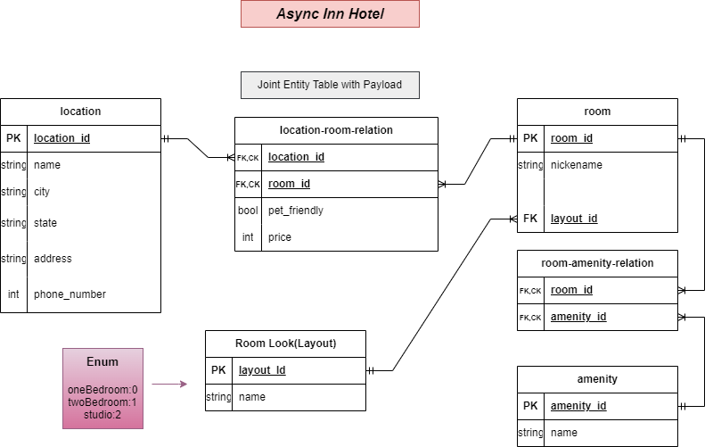

# Async-Inn

## location table
it represent the hotel branches and has these attributes:  id,name, city, state, address, and phone number
## room table
it represent the rooms in the hotel and has attributes: id ,name, and a forigen key for room_look(layout) table.
## location-room relation
is a table represent the many to many relation between location table and room table. and it has attributes: forign keys  room-id and location id and payloads price and pet_friendly

## amintity table
it represent the specifications that room may has with attributes: id, name
## room-aminity- relation
is a table represent the many to many relation between aminity table and room table. and it has attributes: forign keys  room-id and aminity-id.

## room_look (layout) table
it is represent the room layout design with attributes: id, name

# Lab-12

I started creat the app by creat a connection between the ap.net app and sql database using the Entity frameworke core. 

# Lab-13
I used the Dependency Injection and Repository design pattern to update the project.

# Lab-17
finishing adding unit test for hotel service and HotelRoom service, also adding swagger UI
